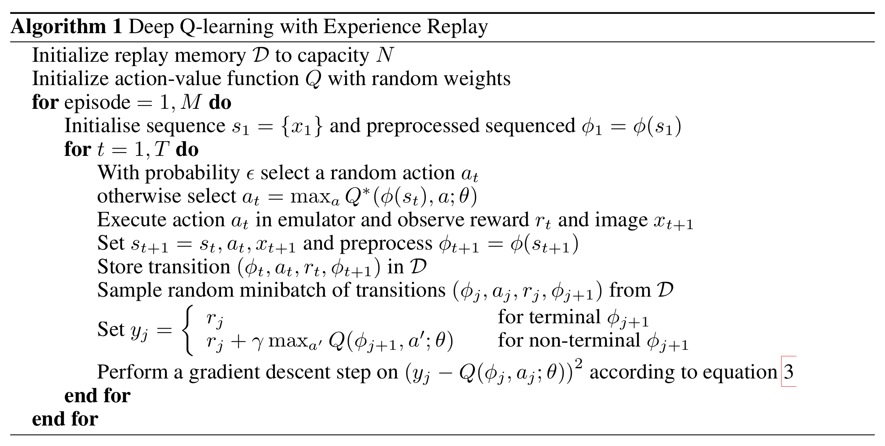
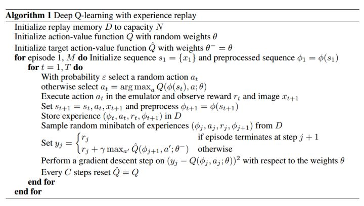

# Playing Atari with Deep Reinforcement Learning

**Authors**: [DeepMind] Volodymyr Mnih, Koray Kavukcuoglu, David Silver, Alex Graves, Ioannis Antonoglou, Daan Wierstra, Martin Riedmiller

**Year**: 2013

**Algorithm**: DQN

**Link:** [[arxiv](https://arxiv.org/abs/1312.5602v1)]

### Highlights

- **Neural network Q-function approximator**
- **Experience replay mechanism**

### Prerequisite

- [Q-learning](https://towardsdatascience.com/simple-reinforcement-learning-q-learning-fcddc4b6fe56)

### Problems to solve

- Learning to control agents from **high-dimensional sensory inputs** like vision and speech is hard.
- RL algorithms have to learn from a scalar reward that is frequently **sparse, noisy and delayed**. 
- Deep Learning algorithms assume the data samples to be independent. But RL algorithms typically encounter sequences of **highly correlated** states. Also, the data distribution is **non-stationary** for RL. It changes as the agent learns new behaviors.

### Methods

- **Neural network function approximator**: For atari games, the state space is large and the action space is small, it's infeasible to use Q table to solve the games. A neural network function approximator with weight $\theta$ as the action-value function approximator can do the work, namely Deep Q Network. 
  - Use **CNN** to extract the high-level features of the high-dimensional sensory input data of the game interface. The parameters can be updated with a variant of Q-Learning, with SGD to update the weights.
- **Experience replay mechanism**
  - At each time step, the agent stores its experience as state transitions pooled over many episodes into a *replay memory*.
  - When updating the Deep Q Network, the agent randomly samples a minibatch of state transitions from the replay memory. And the agent performs minibatch gradient descent on the mean square error between (state-action value) and  (TD-target).
- **Algorithm**

> 

- **Tricks**
  - **Reward clipping**: Since the scale of scores varies greatly from game to game, positive rewards were set to 1 and all negative rewards set to be −1, leaving 0 rewards unchanged. Clipping the rewards in this manner limits the scale of the error derivatives and makes it easier to use the same learning rate across multiple games.
  - **Frame-skipping**: The agent sees and selects actions on every  frame instead of every frame, and its last action is repeated on skipped frames. -> play more games without increasing too much runtime.

### Comments

- **Advantages of the algorithm**
  - Each step of the experience is potentially used for updates -> **data efficiency**
  - Learning directly from consecutive samples is inefficient, due to the strong correlations between the samples; **randomizing the samples** breaks these correlations and therefore reduces the variance of the updates.
  - By using experience replay, the agent learns **off-policy**. 
    - The behavior distribution is averaged over many of its previous states, smoothing out learning and avoiding oscillations or divergence in the parameters. If the agent learns on-policy, the training samples will be dominated by samples generated by a biased policy, which leads to unwanted feedback loops, poor local minimum, or even divergence. 
    - For example, if the maximizing action is to move left then the training samples will be dominated by samples from the left-hand side; if the maximizing action then switches to the right then the training distribution will also switch.

- **Further Modification**

  - In 2015, DeepMind published [*Human Level Control Through Deep Reinforcement Learning*](https://storage.googleapis.com/deepmind-media/dqn/DQNNaturePaper.pdf), an updated version of DQN, by using an additional **target action-value network** to approximate the TD-target value for optimization. 

  - **Advantage:** Generating the targets using an older set of parameters adds a delay between the time an update to  is made and the time the update affects the targets , making divergence or oscillations much more unlikely.

  - **Algorithm**

    > 
