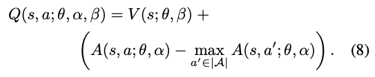
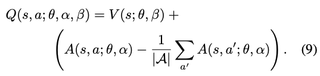
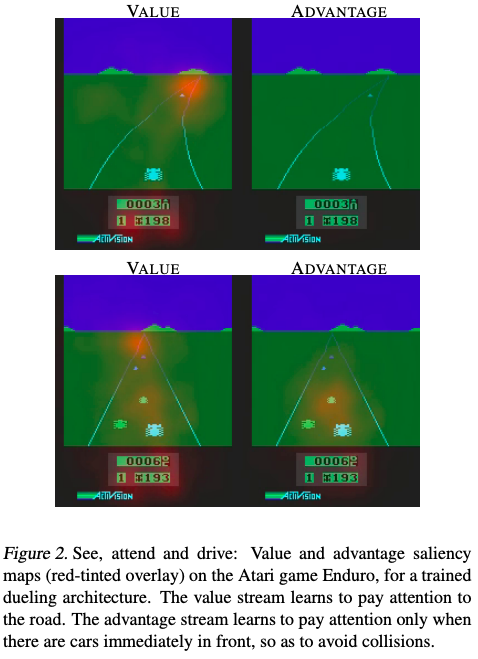

# Dueling Network Architectures for Deep Reinforcement Learning

**Authors**: Ziyu Wang, Tom Schaul, Matteo Hessel, Hado van Hasselt, Marc Lanctot, Nando de Freitas

**Year**: 2015

**Algorithm**: Dueling DQN

**Link**: [[arxiv](https://arxiv.org/abs/1511.06581)]

### Highlight

- **Dueling Architecture: Separating state value function and action advantage function**

### Prerequisites

- DQN algorithm [[paper](https://www.cs.toronto.edu/~vmnih/docs/dqn.pdf)] [[summary](https://github.com/RPC2/DRL_paper_summary/blob/master/01%20Model-Free%20RL/003%20Dueling%20Network%20Architectures%20for%20Deep%20Reinforcement%20Learning.md)]
- Knowledge on advantage function

### Main Contributions

- It proposes a new neural network architecture to better aid with policy learning without changing the underlying reinforcement learning algorithm.

### Methods

- **The Dueling Architecture**: It modifies the original DQN network structure by introducing two streams of fully connected layer after all the convolution operations: 

  - One serves as the state value estimator

  - Another calculates the advantage for each action.

  - The network structure:

    (top: the regular single-stream DQN, bottom: the dueling Q-network)

    

- Aggregation: using the definition of advantage, aggregating module is constructed as follows:

  

- Unidentifiability

  - Problem: Equation (7) is unidentifiable in the sense that given  we cannot recover  and  uniquely. To see this, add a constant to  and subtract the same constant from . This constant cancels out resulting in the same  value.
  - Improvement: For a deterministic policy, , it follows
    that and hence . So we can force the advantage function estimator to have zero advantage at the chosen action.
    
    
    
    - Now, for , we obtain . Hence, the stream  provides an estimate of the value function, while the other stream produces an estimate of the advantage function.
  - Alternative:
    
    
    
    - (9) does not change the relative rank of  (and hence ) values. On the one hand this loses the original semantics of  and  because they are now off-target by a constant, but on the other hand it increases the stability of the optimization.

- By separating the state and advantage estimation, intuitively, the dueling architecture can learn which states are valuable without having to learn the effect of each action for each state (which is adopted by the standard Q learning).

- The author reported significant performance boost compared to the single-network version of DQN.

### Comments

- **Key insights**: 
  
- In some states, which actions to take for the agent doesn't have significant meanings to the scoring of the game. In Breakout and Pong, it might be the times when the ball is very far away from the sliding bar. In Enduro (a car racing game), it is when a collision is unlikely to happen. 
  
- This paper leverages this observation, and interestingly, reported the saliency maps during game playing. The value stream and the advantage stream learns to pay attention to different objects in the game state:

  