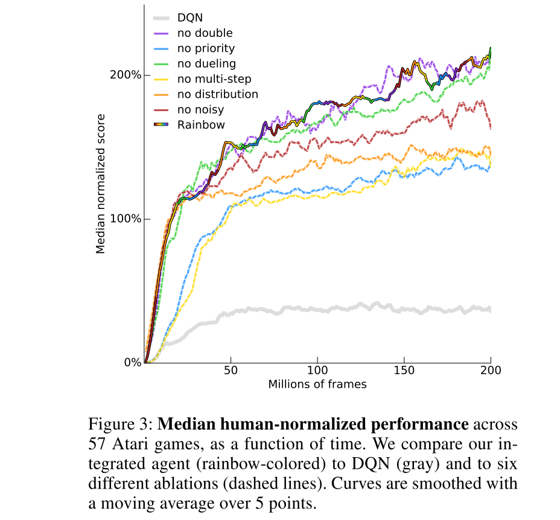

# Rainbow: Combining Improvements in Deep Reinforcement Learning

**Authors**: Matteo Hessel, Joseph Modayil, Hado van Hasselt, Tom Schaul, Georg Ostrovski, Will Dabney, Dan Horgan, Bilal Piot, Mohammad Azar, David Silver

**Year**: 2017

**Algorithm**: **Rainbow DQN**

**Links:** [[arxiv](https://arxiv.org/abs/1710.02298)]

### Highlights

- **Integrated Agent** = **Double + PER + Dueling** + **Multi-step Learning** + **Distributional RL** + **Noisy Nets**

### Prerequisite

- DQN algorithm [[paper](https://www.cs.toronto.edu/~vmnih/docs/dqn.pdf)] [[summary](https://github.com/RPC2/DRL_paper_summary/blob/master/01%20Model-Free%20RL/001%20Playing%20Atari%20with%20Deep%20Reinforcement%20Learning.md)]
- Double Q-Learning [[paper](https://arxiv.org/abs/1509.06461)] [[summary](https://github.com/RPC2/DRL_paper_summary/blob/master/01%20Model-Free%20RL/004%20Deep%20Reinforcement%20Learning%20with%20Double%20Q-learning.md)]
- Priorized Experience Replay [[paper](https://arxiv.org/abs/1511.05952)] [[summary](https://github.com/RPC2/DRL_paper_summary/blob/master/01%20Model-Free%20RL/005%20Prioritized%20Experience%20Replay.md)]
- Dueling DQN [[paper](https://arxiv.org/abs/1511.06581)] [[summary](https://github.com/RPC2/DRL_paper_summary/blob/master/01%20Model-Free%20RL/003%20Dueling%20Network%20Architectures%20for%20Deep%20Reinforcement%20Learning.md)]

### Background

- Multiple improvements have been applied to DQN separately. This paper intends to combine all these improvements together.

#### DRL and DQN

- In DQN, deep neural nets and reinforcement learning were combined by using a CNN as a function approximator for the action values given high-dimensional sensory data.

#### Double Q-Learning

- Conventional Q-learning is affected by an overestimation bias, which can harm learning. Double Q-learning addresses this overestimation by decoupling the selection of the action from its evaluation. It uses the target of 
  - 

#### Prioritized Experience Replay

- PER samples transitions with probability  relative to the last encountered absolute **TD error**:
  - 
  - where  is a hyperparameter that determines the shape of the distribution.
- TD error shows how far the value is from its next-step bootstrap estimate, indicating how "surprising" or unexpected the transition is.
- New transitions are inserted into the replay buffer with maximum priority, providing a bias towards recent transitions. 

#### Dueling networks

- The dueling network is an architecture designed for value based RL. It features two streams of computation, the value and advantage streams, sharing a convolutional encoder, and merged by a special aggregator.
- This corresponds to the following factorization of action values:
  - 
  - , , : the parameters of the shared encoder , of the value stream , and of the advantage stream ;  is their concatenation.

#### Multi-step Learning

- Use **multi-step return** instead of one-step reward:
  - 
- The alternative loss: 

- The value function can be learned faster in this way, because the value can be more accurately estimated with multi-step return.

#### Distributional RL

- The agent can learn to approximate the distribution of returns instead of the expected return. The distributional perspective allows the agent to gain information on the risks of the actions. (e.g. the value  = {10: 90%, 110: 10%} vs. {15: 50%, 25: 50%})
- Distributed RL use a discrete distribution to model the value distribution.  is divided into  equal parts to build the support . The probability distribution  at time  is defined on the support , with the probability pass   on each atom , such that.
- KL-Divergence is used to measure the distance between the distribution $d_t$ and the target distribution 
  - Hence, the resulting loss is 
  - Here  is the L2-projection of the target distribution onto the fixed support , and  is the greedy action w.r.t. the mean action values  in state .

#### Noisy Nets

- -greedy has limitations in games, where many actions must be executed to collect the first reward. Hence, Noisy Nets proposed a **noisy linear layer** that combines a deterministic and noisy stream,
  - 
  - This can be used in place of the standard linear .
- Over time, the network can learn to ignore the noisy stream, but will do so at different rates in different parts of the state space, allowing state-conditional exploration with a form of self-annealing.

### Method

#### The Integrated Agent

- Replace the 1-step **distributional** loss with a **multi-step variant.** Then construct the target distribution as follows:
  
- 
  
- The resulting loss is .

- **Double Q-Learning:** using the greedy action in $S_{t+n}$ selected according to the *online network* as the bootstrap action  and evaluating such action using the *target network*. 

- **PER:** all distributional Rainbow variants prioritize transitions by the KL loss, since this is what the algorithm is minimizing: . The KL loss as priority might be more robust to noisy stochastic environments because the loss can continue to decrease even when the returns are not deterministic.

- **Dueling Network**: 

  - Shared representation , which is fed into **value stream**  with  outputs, and into **advantage stream**  with  outputs, where  denotes the output corresponding to atom  and action .
  - For each atom , the value and advantage stream are aggregated, as in dueling DQN, and then passed through a softmax layer to obtain the normalized parametric distributions used to estimate the returns' distributions:
  - 
  
  
  
- where  and 
  
- Then all linear layers are replaced with their **noisy** equivalent described before. Here, we use **facrotised Gaussian noise** to reduce the number of independent noise variables.

### Results and discussion

- The integrated agent provides SOTA performance on Atari 2600, both in terms of data efficiency and final performance.
  
  - 
- From the above ablation studies, we can assess the effects of different components respectively
  - **Prioritized replay** and **multi-step learning** were the two most crucial components of Rainbow, in that removing either component caused a large degradation in median performance.
    - **PER** improves data efficiency, by replaying more often transitions from which there is more to learn. 
    - Learning from **multi-step** bootstrap targets shifts the bias-variance trade-off and helps to propagate newly observed rewards faster to previously visited states.
  - **Distributional Q-learning** ranked immediately below the previous techniques related to the agent's performance.
  - The agent performed better when **Noisy Nets** were included in terms of median performance. It's used to address the limitation of -greedy policies, where many actions must be executed to collect the first reward.
  - **Dueling network** is expected to help generalize across actions by separately representing state values and action advantages. In aggregate, we don't observe a significant difference when removing the dueling network from Rainbow. However, extensive experiments showed the impact of Dueling varied between games. 
  - In the case of **Double Q-learning**, the observed difference in median performance is limited. In the above settings of experiments, was set to [-10, 10] so as to enable distributional RL. Extensive investigation showed that comparing Rainbow to the double-ablated agent, the actual returns are often higher than 10, and therefore fall outside the support of the distribution from -10 to +10. This leads to underestimated returns. In this case, the function of double Q-learning to mitigate the overestimation of value was then disabled. Note the importance of double Q-learning may increase if the support of the distributions is expanded.