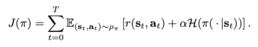

# Soft Actor-Critic: Off Policy Maximum Entropy Deep Reinforcement Learning with a Stochastic Actor

**Authors: Tuomas Harrnoja, Aurick Zhou, Pieter Abbeel, Sergey Levine**

**Year: 2018**

**Algorithm: SAC**

**Link**: [[arxiv](https://arxiv.org/abs/1801.01290)]

### Highlight

- Bridging actor-critic methods with Q learning
- Incorporating policy entropy into reward functions --> A substantial improvement in exploration and robustness

### Prerequisites

- Basic understandings on Q-learning and Policy Gradient methods

### Main Contribution

- It connects both on-policy and off-policy methods to reduce sample complexity while being stable across hyperparameters and random seeds
- It incorporates policy entropy into reward functions --> A substantial improvement in exploration and robustness
- It is the first off-policy actor-critic method in the maximum entropy reinforcement learning framework.

### Methods

- **Maximum Entropy Reinforcement Learning**

  - Standard RL maximizes the expected sum of rewards from the environments, but the maximum entropy methods favor stochastic policies by including the policy's entropy into the objective calculation:

    

  - The  term determines the relative importance of the entropy term against the reward, and thus controls the extent of randomness (stochasticity) of the optimal policy.

  - Advantages of this design:

    1. The policy is incentivized to explore more widely.
    2. The policy can capture multiple modes of near-optimal behavior.
    3. Exploration is improved.

- **Derivation of Soft Policy Iteration**

  - 