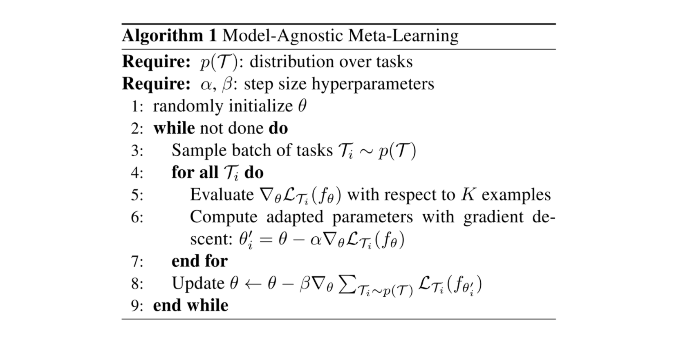
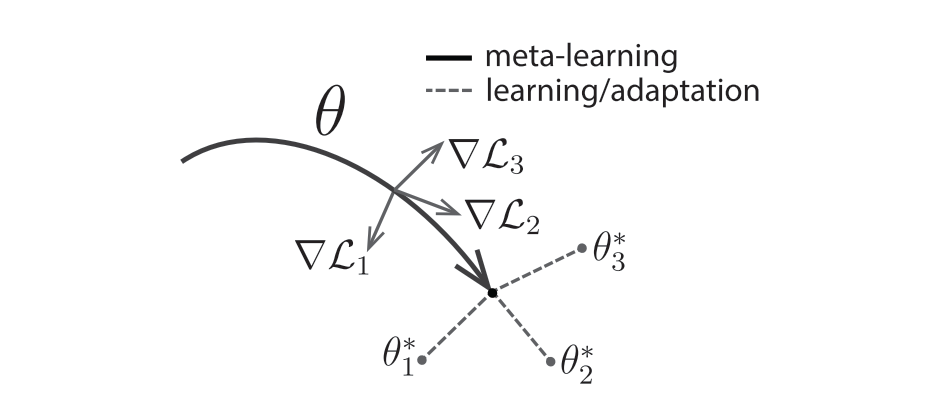
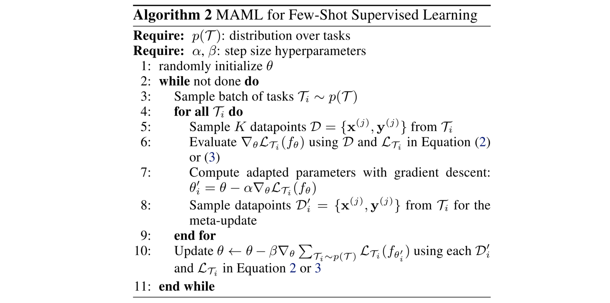
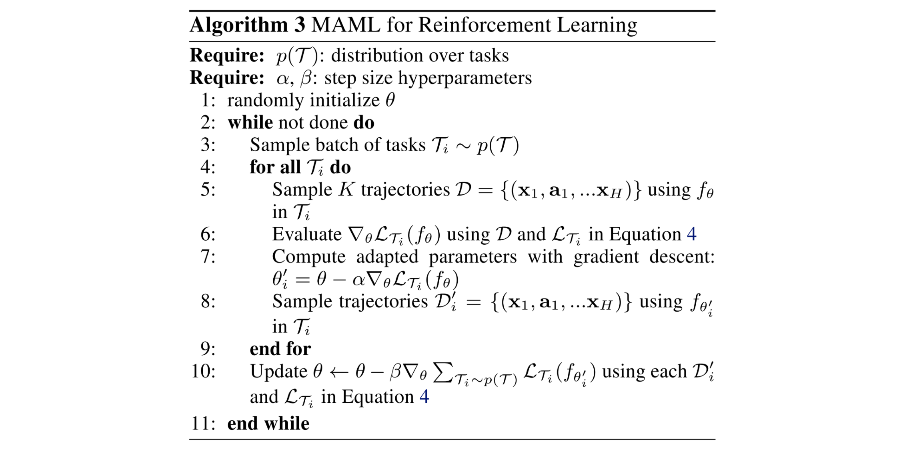

# Model-Agnostic Meta-Learning for Fast Adaptation of Deep Networks

**Authors**: Chelsea Finn, Pieter Abbeel, Sergey Levine

**Year**: 2017

**Algorithm**: **MAML**

**Links:** [[arxiv](https://arxiv.org/abs/1703.03400)]

### Highlights

- **A general and model-agnostic meta-learning algorithm**

### Prerequisite

- [Introduction to Policy Optimization](https://spinningup.openai.com/en/latest/spinningup/rl_intro3.html), OpenAI Spinning Up

### Problems to solve

- The challenges of learning quickly occur in few-shot classfication and reinforcement learning. An artificial agent should be able to learn and adapt quickly from only a few examples, and continue to adapt as more data becomes available.
- **The goal of meta-learning** is to train a model on a variety of learning tasks, such that it can learn quickly to solve new tasks with only a small number of training samples.

### Method

- **Intuition**: Find a efficient initialization of model parameters that are sensitive to changes in the task, such that small changes in the paramters will produce large improvements on the loss function of any task.

- **Method**: Adaptation Phase + Meta-Update Phase
  - Quick Adaptation on Tasks
    - When adapting to a new task , the model parameters  become , which is computed by one or more gradient descent updates on task .
      - One gradient update: 
  - Meta-optimization
    - The model parameters  is updated for optimizing the performance of  w.r.t.  across tasks sampled before.
    - The meta-objective (sum of loss from quickly adapted models on their tasks respectively) performed over  is 
      - 
    - The meta-phase update on  is as follows:
      - 
    - Computationally, the meta phase requires an additional backward pass through $f$ to compute Hessian-vector products. This process is supported by standard DL libraries.
  - In effect, the method optimizes  such that one or a small gradient steps on a new task will produce maximally effective behavior on that task.
  - Algorithm
    - 
    - 

- **Species of MAML**
  - MAML can be used for supervised learning and reinforcement learning. In this section, we will focus more on its application in reinforcement learning.
  - Supervised Regression and Classification
    - The goal is to learn a new function from a few data of that task, using meta learned prior knowledge from similar tasks. e.g. the goal might be to classify images of a Segway after seeing only one or a few examples of a Segway, with a model that has previously seen many other types of objects.
    - Conceptually, meta-learning learns a model that quickly learns how to classify a new object.
    - Algorithm
      - 
  - Reinforcement Learning
    - Goal: quickly acquire a poicy for a new test task (achieving a new goal/succeeding on a previous goal in a new environment) using only a small amount of experience in the test setting.
    - Since policy gradient methods are on-policy, hence each additional gradient step during the adaptation of  requires new samples from the current policy . See the difference at step 5 and 8 requiring sampling trajectories from the environment corresponding to the task .
    - Algorithm
      - 